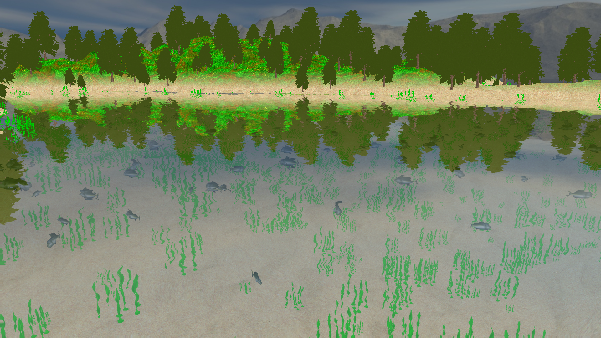
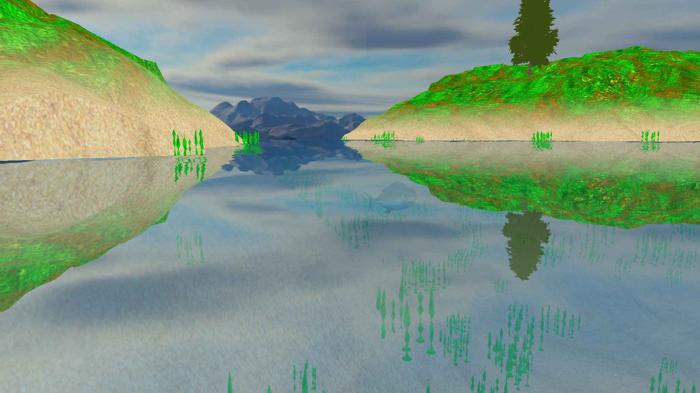
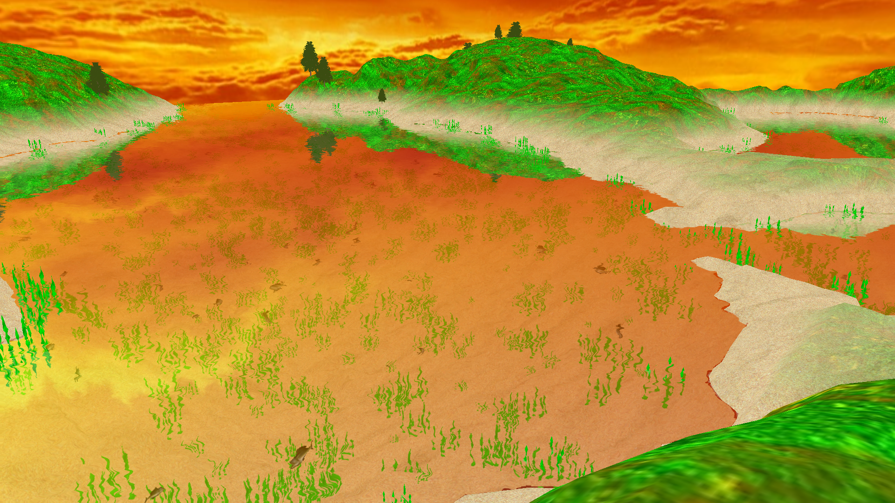

# (Wildlife and Enhanced Water OpenGl Renderer (WEWOR)

WEWOR aims to get a good water rendering using openGL. 
To ensure our rendering is giving good results, we implemented a terrain generated with an height-map, 
some fish and seaweeds, a skybox that we can be switched dynamically and the water surface rendering.

We used modern water rendering techniques such as reflection/refraction, a DuDv map, 
Fresnel coefficient and water depth.

Some screenshots of WEWOR

